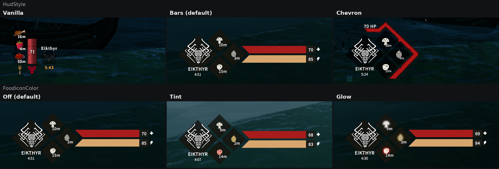
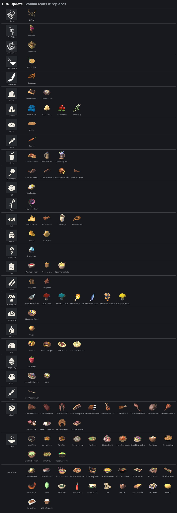

# HUD Update

A Nordic-styled replacement for the lower-left Valheim HUD: guardian power, food and health in one compact block of diamonds. Client-side, no server install required.

> **0.1.2 — early release.** Everything below works in the author's game, but the mod has not been tested with every setup yet. Bug reports and screenshots are welcome.

## Screenshots

Top row: vanilla HUD, `HudStyle = Bars`, `HudStyle = Chevron`. Bottom row: `FoodIconColor = Off`, `Tint`, `Glow`.



<details>
<summary>All food icons next to the vanilla ones they replace</summary>



Foods in the last row keep their game icon for now.

</details>

## Features

- **Guardian power diamond** with white knotwork emblems for Eikthyr, The Elder and Bonemass, the power name and cooldown.
- **Three food diamonds** with flat, white food icons (23 drawn icon types covering vanilla foods up to the Ashlands) and a readable timer. An empty slot shows a dimmed plate.
- **Vanilla-style reminder:** a food icon pulses once you can eat it again (less than half of its time left), exactly like the base game.
- **Two HUD styles**, switchable in the config while the game runs:
  - `Bars` (default) — slanted health and stamina bars with value plates and ✚ / ⚡ icons.
  - `Chevron` — a 2×2 food grid framed by a red health chevron with an "N HP" label; stamina stays vanilla.
- **Replaceable icons:** every icon is a PNG in the `Icons` folder, swap any of them for your own.
- **Optional stat colouring** of food icons: red for health, yellow for stamina, blue for eitr, white for balanced food. Tint, soft glow, or both. Off by default.
- A damage trail shows how much health you just lost.

## Installation

**Mod manager (r2modman / Thunderstore Mod Manager):** install *HUD Update*; BepInExPack Valheim is installed automatically.

**Manual:** install [BepInExPack Valheim](https://thunderstore.io/c/valheim/p/denikson/BepInExPack_Valheim/), then copy the `HUD-Update` folder (the DLL and the `Icons` folder) into `BepInEx/plugins/`.

## Custom icons

Every icon is a PNG in `BepInEx/plugins/HUD-Update/Icons`. Replace a file with your own picture under the same name and the HUD updates within a second, even in game. Delete a file to get the built-in icon back: the DLL keeps its own copies, so the mod also works without the folder.

A mod update restores that folder. To keep your own icons, put them in `BepInEx/config/HUD-Update/Icons` instead; it is created on the first launch and wins over the plugin folder.

- `food_*.png` — glyphs shared by many dishes (`food_steak`, `food_stew`, `food_pie`…).
- `<FoodPrefab>.png` — an icon for one exact food, e.g. `CookedMeat.png`.
- `Eikthyr.png`, `TheElder.png`, `Bonemass.png` — guardian emblems; `GP_<Power>.png` (`GP_Moder.png`, `GP_Yagluth.png`, `GP_Queen.png`, `GP_Fader.png`) adds one for any other guardian.
- `HealthIcon.png`, `StaminaIcon.png`, `chevron_shape.png`, `chevron_outline.png` — bar signs and the health chevron.

Square PNGs with a transparent background work best. `FoodIconColor = Tint` colours the icon, so it looks right on white or light icons. `Icons/README.txt` lists the same rules.

## Configuration

`BepInEx/config/crevitka.hudupdate.cfg` is created on the first launch. Save the file while the game is running and the HUD updates within about a second.

| Section | Setting | Values | Default |
|---|---|---|---|
| General | `HudStyle` | `Bars`, `Chevron` | `Bars` |
| Food | `FoodIconColor` | `Off`, `Tint`, `Glow`, `TintAndGlow` | `Off` |
| Food | `FoodGlowStrength` | `0` – `1` | `0.7` |

A food counts as "health", "stamina" or "eitr" when that stat is at least 30 % higher than the next one; otherwise it is shown as balanced (white). Tint is applied only to the mod's own white icons — vanilla colour icons keep their colours and only get the glow.

## Compatibility

- Client-side only. Works on vanilla and modded servers; other players do not need it.
- Replaces the vanilla health panel, food icons and guardian power display (and, with `Bars`, the stamina bar). Mods that restyle the same HUD parts — for example **Auga** or other full HUD overhauls — are not compatible.
- Mods that only add items are fine: unknown foods get a matching icon by name (soup, pie, jam, meat…) or keep their own icon.

## Known limitations

- The HUD font is the game's own; it may look slightly different from the artwork.
- Moder, Yagluth, the Queen and Fader do not have custom emblems yet and use the game's icon (you can add your own, see *Custom icons*).

## Building from source

Requires Windows, a .NET SDK (or Visual Studio 2022), Valheim and BepInExPack Valheim. Game, Unity and BepInEx assemblies are referenced from your own installation and are not part of this repository.

**PowerShell script** (no Visual Studio needed):

```powershell
./build-plugin.ps1 -ValheimDir 'D:\Games\Valheim'
```

**Visual Studio / MSBuild:** open `HUD-Update.sln`, or

```powershell
msbuild HUD-Update.csproj /p:Configuration=Release /p:ValheimDir="D:\Games\Valheim"
```

`Debug` builds are written straight to `BepInEx/plugins/HUD-Update/` of the selected game folder. Without `ValheimDir` both use the default Steam path under Program Files (x86). Output: `bin/Release/HUD-Update.dll` and `bin/Release/Icons/`.

**Release packages:** `./Release/package.ps1` validates versions and builds the Thunderstore, Nexus and source ZIPs into `Release/dist/`.

### Repository layout

| Path | Contents |
|---|---|
| `HudUpdatePlugin.cs` | Plugin entry point, config, Harmony prefixes on `Hud.UpdateHealth` / `UpdateStamina` / `UpdateFood`, both HUD layouts |
| `TmpFontFixPatch.cs` | Assigns the game's TextMeshPro font to the panel texts |
| `Icons/` | PNGs shipped next to the DLL and embedded as a fallback (`UIReforge.Icons.<name>`): food glyphs, guardian emblems, ✚ / ⚡, chevron frame |
| `Bundles/hudPrefab` | Unity asset bundle with the panel prefab (`UIReforge.Bundles.hudPrefab`) |
| `IconSource/` | Python generators that reproduce the food icons and chevron textures exactly; `make_screenshot_grid.py` / `make_icon_comparison.py` build the README pictures; `IconDump.cs` is the one-off helper plugin that exports vanilla food icons for the comparison |
| `Release/` | Thunderstore manifest, icon, READMEs, changelog, Nexus description, packaging script, cover artwork |

## Credits and licence

Author: **Crevitka**. Guardian emblems (Eikthyr, The Elder, Bonemass): **𝗛คηɗץ**.

MIT License — see `LICENSE`. Developed with AI assistance. No game assets are included.
